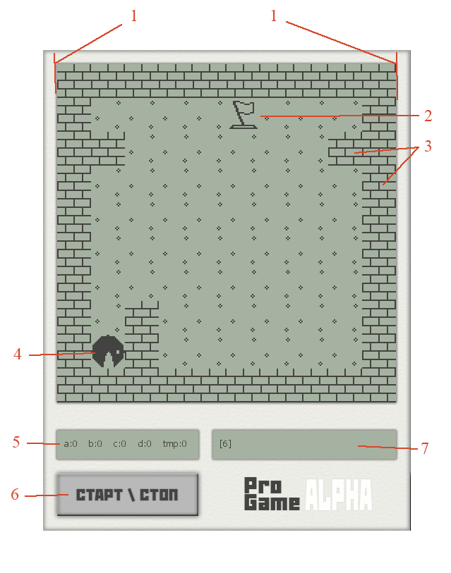

# ProGame
Игра обучающая программированию.
---
Является инструментом для обучения основам программирования
---
В игре предстоит управлять персонажем посредством специальных инструккций (псевдо языка программирования).
# Интерфейс

